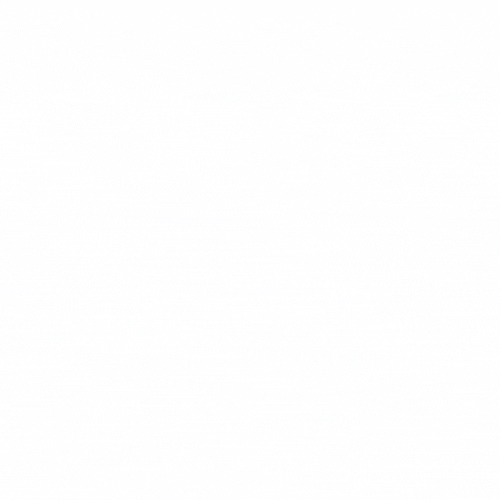

## About Project

This project is the back-end of my personal website [zedan.me](https://zedan.me) built on the [Laravel Framework](https://laravel.com) 💘.

## License

The Laravel framework is open-sourced software licensed under the [MIT license](https://opensource.org/licenses/MIT).
